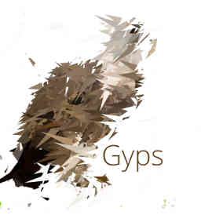

# Gyps
> Cheap reactive programming library

## API
### Gyps()
Create a stream.

### gyps.emit(data)
Emit an event, calling all observers.
> param data Data object to be used on calling observers

### gyps.observe(observer)
Add a new observer. If an event was emitted before, the observer is called with the last value.
> param observer Observer function to be added

### gyps.constant(value)
Map all values to a constant.
> param value Constant that will be emitted

### gyps.filter(predicate)
Only emit values that pass the predicate.
> param predicate Test function, returns true if pass

### gyps.flatten()
Transform a observable of observables into a observable of values emitted by values of the original observable.

### gyps.map(mapper)
Transform each value by a function.
> param mapper Function that will be applied to each value

### gyps.merge(stream[, stream])
Combine multiple observables into one.
> param streams Observables to be joined

### gyps.scan(reducer, initial)
Accumulate values using a function.
> param reducer Function that receives the accumulated value and a new value, and return the new accumulated
> param initial Initial value

### gyps.trigger(stream)
Takes an observable of values, each time the original observable emits, this observable emits the last value emitted by the observable of values.
> param stream Observable of values to be emitted

### gyps.wrap(key)
Wrap each value into an object with the key provided.
> param key Key used to wrap values

## Meta
This project is based on [eye](https://github.com/huijari/eye).

Distributed under Apache license. See ``LICENSE`` for more information.

[Huijari](https://github.com/Huijari)
